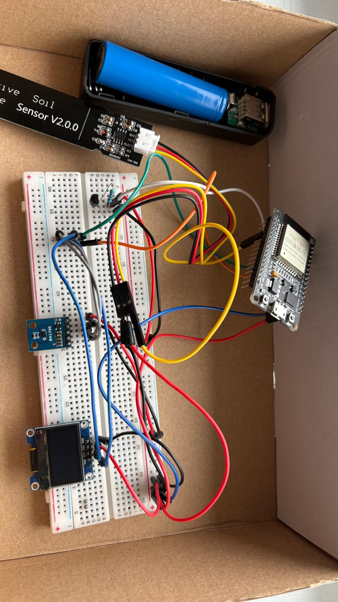
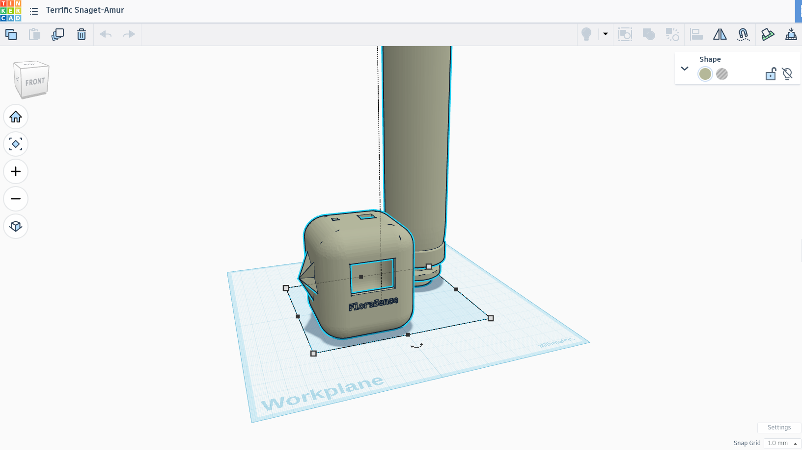

# FloraSense: Smart Plant Monitoring System

## Overview

FloraSense is an end-to-end IoT solution designed to monitor environmental conditions for indoor plants in real-time. By integrating specialized hardware sensors with a **modern** web dashboard, the system provides actionable insights into soil moisture, ambient temperature, and light intensity to ensure optimal plant health.

<IMAGE_WITH_FINAL_DESIGN>

## The Problem

Maintaining plants requires consistent monitoring of variables that are often invisible or easily overlooked. Common issues include:

- **Overwatering/Underwatering**: Leading to root rot or dehydration.
- **Inadequate Light**: Affecting photosynthesis and growth.
- **Thermal Stress**: Exposure to temperatures outside the optimal range.

FloraSense solves these problems by providing a high-precision digital interface that alerts the user when parameters cross **safe thresholds**.

> ### Early Prototype (Inside a box literally)

## Hardware Components

The system utilizes the following hardware for data acquisition and local visualization:

| Component                         | Function                                                                 |
|---------------------------------- |        ------------------------------------------------------------------|
| ESP32 DevKit V1                   | Main microcontroller with Wi-Fi connectivity for data transmission.      |
| Capacitive Soil Moisture Sensor   | Measures volumetric water content without electrode corrosion.           |
| BH1750 Light Sensor               | Provides high-resolution illuminance measurements in Lux.                |
| DS18B20 Temperature Sensor        | High precision ambient temperature sensing.                              |
| "0.96"" OLED Display (I2C)"       | Local real-time visualization of sensor readings.                        |
| 18650 Power Bank Kit              | Portable power management for the sensor node.                           |

## Features

**Real-Time Monitoring**:

The dashboard connects via Supabase Realtime to provide live updates without refreshing the page. As soon as the ESP32 pushes data, the charts update **instantly**.

**Historical Data Analytics**:

- **Time Range Selection**: View data from the last hour up to 30 days.
- **Trend Analysis**: Calculated averages and trends (up/down) for moisture, temperature, and light.
- **Export Functionality**: Users can download the entire history in CSV format for external analysis.

**Smart Alerts**:

- **Custom Thresholds**: Users can set personalized thresholds for each parameter.
- Dynamic alert cards appear when the system detects:
  - Soil moisture below the set threshold.
  - Temperature outside the optimal range.
  - Insufficient light levels.

**Data Maintenance**:

 Options to backup settings or clear sensor history.

## Design and Assembly

The enclosure and layout were planned using **Tinkercad** to ensure a compact form factor that protects the electronics from soil humidity.

<IMG_INSIDE>

## Software Stack

### Frontend

- **Framework**: Next.js 15
- **Design**: Tailwind CSS
- **Charts**: Recharts (Area and Line charts)
-**Animations**: Framer Motion
-**Icons**: Lucide React

### Backend/Database

- **Database**: Supabase (PostgreSQL)
- **Real-time**: Postgres Changes via WebSockets
- **API**: Next.js Route Handlers (POST/GET/DELETE)

## Contribution

Contributions are welcome! If you have ideas for new features, improvements, or bug fixes, please open an issue or submit a pull request.

## License

This project is licensed under the MIT License - see the [LICENSE](./LICENSE.md) file for details.
